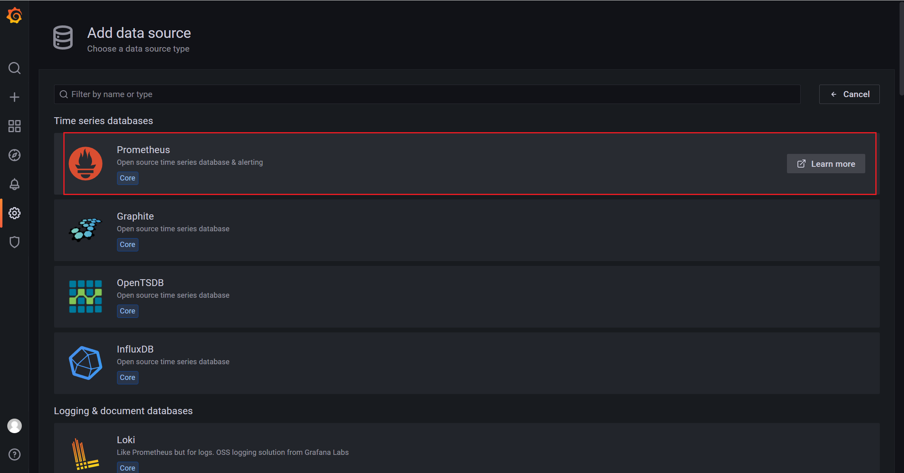
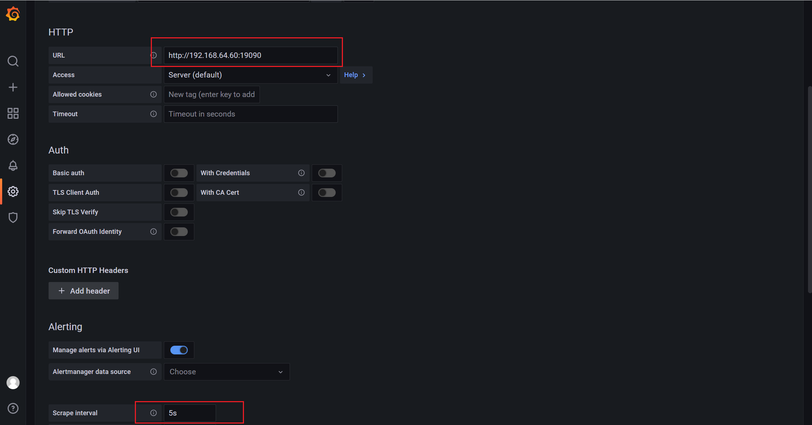
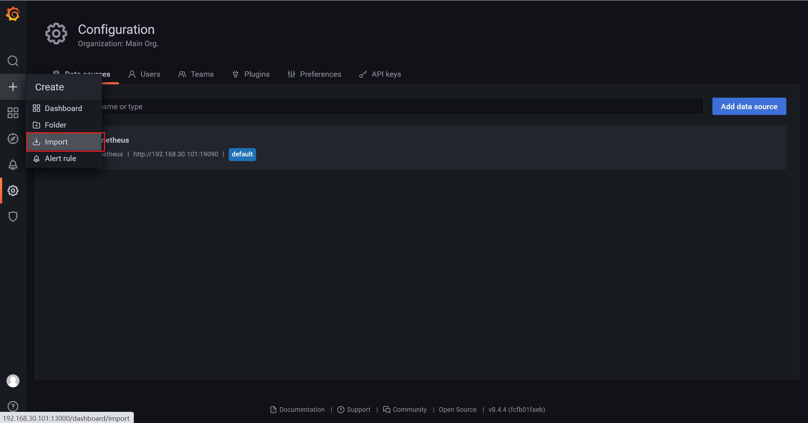
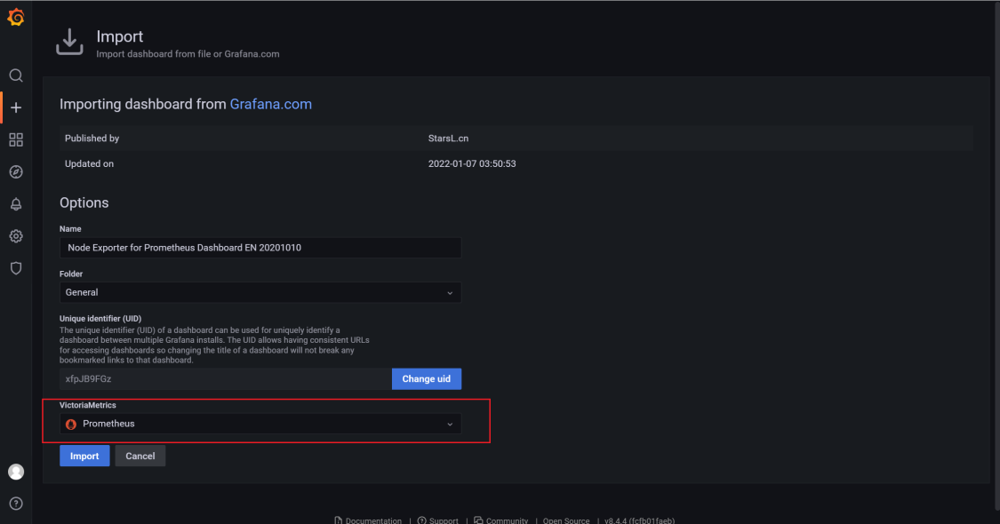

# Prometheus+Grafana搭建MySQL/StoneDB监控平台

## Prometheus介绍
[Prometheus](https://github.com/prometheus) 是由前 Google 工程师从 2012 年开始在 [Soundcloud](http://soundcloud.com/) 以开源软件的形式进行研发的系统监控和告警工具包，自此以后，许多公司和组织都采用了 Prometheus 作为监控告警工具。Prometheus 的开发者和用户社区非常活跃，它现在是一个独立的开源项目，可以独立于任何公司进行维护。为了证明这一点，Prometheus 于 2016 年 5 月加入 [CNCF](https://cncf.io/) 基金会，成为继 [Kubernetes](http://kubernetes.io/) 之后的第二个 CNCF 托管项目，详细介绍可以参考：[https://prometheus.fuckcloudnative.io/di-yi-zhang-jie-shao/overview](https://prometheus.fuckcloudnative.io/di-yi-zhang-jie-shao/overview)

Prometheus 官方下载地址：[https://prometheus.io/download/](https://prometheus.io/download/)

Grafana 介绍：

Grafana 是一个开源的监控数据分析和[可视化](https://so.csdn.net/so/search?q=%E5%8F%AF%E8%A7%86%E5%8C%96&spm=1001.2101.3001.7020)套件。最常用于对基础设施和应用数据分析的时间序列数据进行可视化分析，也可以用于其他需要数据可视化分析的领域。Grafana 可以帮助你查询、可视化、告警、分析你所在意的指标和数据。可以与整个团队共享，有助于培养团队的数据驱动文化。

具体介绍可以查看官网介绍：[Grafana 简介](https://grafana.com/docs/grafana/latest/introduction/)

Grafana 官网地址： [https://grafana.com/](https://grafana.com/)
## 部署环境
A机器 Docker 部署 Prometheus+Grafana

B机器 mysqld_exporter+node_exporter
### 为何要挂载数据文件和配置文件？
因为本文采用 docker 部署方式，docker 容器重启后没有挂载出来的配置文件和数据文件有可能会被重置，为了防止监控数据丢失，需要把数据文件挂载出来，另外挂载配置文件可以在物理机上修改，重启 docker 即可应用到 docker 中，不需要进入到容器内部修改。

<p id="1"></p>

## 第一步：部署 Prometheus 
在A机器上使用 docker 先拉起一个 Prometheus，或者从 Prometheus 官网下载 tar 包解压，拿到里面的 prometheus.yml 和 data 文件，放置到指定目录。本文把 data 和 yml 文件分别放置到 /home/prometheus 下的data/ 和config/ 文件下。
```shell
# 先启动一个没有挂载没有端口映射的 Prometheus
docker run -d    \
prom/prometheus

mkdir -p /home/prometheus/data/
mkdir -p /home/prometheus/config/
# 拷贝配置和数据文件
docker ps
docker cp 3fe0e3ea2aa5:/etc/prometheus/prometheus.yml /home/prometheus/config/
docker cp  3fe0e3ea2aa5:/prometheus /home/prometheus/data/
# data 文件夹需要设置下权限，否则挂载进去会出现数据写入权限不足的问题
chmod 777 /home/zsp/prometheus/data/*

cd /home/zsp/prometheus/
tree
.
├── config
│   └── prometheus.yml
└── data
    ├── chunks_head
    │   ├── 000001
    │   └── 000002
    ├── queries.active
    └── wal
        ├── 00000000
        └── 00000001
```
重新启动一个新容器并设置挂载数据目录和配置文件。
```shell
docker run -d  --restart=always --name=prometheus  -p 9090:9090  \
-v /home/prometheus/config/prometheus.yml:/etc/prometheus/prometheus.yml  \
-v /home/prometheus/data/:/prometheus/     prom/prometheus \
--config.file=/etc/prometheus/prometheus.yml \
--storage.tsdb.path=/prometheus \
--web.enable-admin-api \
--web.enable-lifecycle \
--web.external-url='http://A机器IP:9090'  \
--storage.tsdb.retention.time=30d

```
查看A机器 IP:9090 即部署成功，不成功请使用 docker logs 容器 ID 查看错误日志进行排查


## 第二步：部署 exporter

以 MySQL 和操作系统监控为示例：

建议使用 supervisord 进程来控制监控端的 exporter 服务行为。

supervisord 使用方法参考：[https://www.jianshu.com/p/0b9054b33db3](https://www.jianshu.com/p/0b9054b33db3)
### 部署 node_exporter
下载解压 node_exporter
```shell
wget https://github.com/prometheus/node_exporter/releases/download/v1.3.1/node_exporter-1.3.1.linux-amd64.tar.gz
tar -zxvf node_exporter-1.3.1.linux-amd64.tar.gz
mv node_exporter-1.3.1.linux-amd64 node_exporter
mv node_exporter /usr/local/
cd /usr/local/node_exporter/
# 启动 node_exporter 测试是否正常
./node_exporter

# 启动新终端界面查询
ss -nltp |grep 9100
LISTEN     0      128         :::9100                    :::*                   users:(("node_exporter",pid=17268,fd=3))
```
使用 supervisor 管理 node_exporter 进程。
```shell
vi /etc/supervisord.d/node_exporter.ini

[program:node_exporter]
directory = /usr/local/node_exporter/
command = /usr/local/node_exporter/node_exporter
autostart = true
startsecs = 5
autorestart = true
startretries = 3
user = root
redirect_stderr = true
stdout_logfile_maxbytes = 20MB
stdout_logfile_backups = 20
stdout_logfile = /var/log/supervisor/node_exporter.log

systemctl restart supervisord
```
### 部署 mysqld_exporter
登录机器B设置 mysql 监控账号
```shell
GRANT REPLICATION CLIENT, PROCESS ON . TO 'exporter'@'localhost' identified by 'exporter@123';
GRANT SELECT ON performance_schema.* TO 'exporter'@'localhost';
flush privileges;
```
下载解压
```shell
wget https://github.com/prometheus/mysqld_exporter/releases/download/v0.14.0/mysqld_exporter-0.14.0.linux-amd64.tar.gz
tar -zxvf mysqld_exporter-0.14.0.linux-amd64.tar.gz
mv mysqld_exporter-0.14.0.linux-amd64 mysqld_exporter
mv mysqld_exporter /usr/local/
cd /usr/local/mysqld_exporter/
```
设置 my.cnf 监控账号登录配置文件。
```bash
vi .my.cnf
[client]
user=exporter
password=exporter@123
```
启动 mysqld_exporter 监控。
```bash
# 测试 exporter 是否可以正常工作
/usr/local/mysqld_exporter/mysqld_exporter --config.my-cnf=/usr/local/mysqld_exporter/.my.cnf

ss -nltp |grep 9104
LISTEN     0      128         :::9104                    :::*                   users:(("mysqld_exporter",pid=17266,fd=3))
```
使用 supervisor 管理 mysqld_exporter 进程。
```shell
cat /etc/supervisord.d/mysqld_exporter.ini

[program:mysqld_exporter]
directory = /usr/local/mysqld_exporter/
command = /usr/local/mysqld_exporter/mysqld_exporter --config.my-cnf=/usr/local/mysqld_exporter/.my.cnf
autostart = true
startsecs = 5
autorestart = true
startretries = 3
user = root
redirect_stderr = true
stdout_logfile_maxbytes = 20MB
stdout_logfile_backups = 20
stdout_logfile = /var/log/supervisor/mysqld_exporter.log

systemctl restart supervisord
```

## 第三步：配置 Prometheus 监听 mysqld_exporter 和 node_exporter
```shell
# my global config
global:
  scrape_interval: 15s # Set the scrape interval to every 15 seconds. Default is every 1 minute.
  evaluation_interval: 15s # Evaluate rules every 15 seconds. The default is every 1 minute.
  # scrape_timeout is set to the global default (10s).

# Alertmanager configuration
alerting:
  alertmanagers:
    - static_configs:
        - targets:
          # - alertmanager:9093

# Load rules once and periodically evaluate them according to the global 'evaluation_interval'.
rule_files:
  # - "first_rules.yml"
  # - "second_rules.yml"

# A scrape configuration containing exactly one endpoint to scrape:
# Here it's Prometheus itself.
scrape_configs:
  # The job name is added as a label `job=<job_name>` to any timeseries scraped from this config.
  - job_name: "prometheus"

    # metrics_path defaults to '/metrics'
    # scheme defaults to 'http'.

    static_configs:
      - targets: ["localhost:9090"]

  - job_name: "node_exporter"
    static_configs:
      - targets: ["B机器IP:9100"]
        labels:
          instance: B机器_stonedb

  - job_name: "mysqld_exporter"
    static_configs:
      - targets: ["B机器IP:9104"]
        labels:
          instance: B机器_stonedb
```
添加 mysqld_exporter 和 node_exporter 后，docker 需要重启容器加载下配置文件。
```shell
docker restart 892d640f51b2
```
稍等一会儿查看 Prometheus 上的 Status-Targets 状态（这一步忘记截图了，使用其他环境截图代替），metrics 全为 up 则表示监控采集 metrics 采集成功。


## 第四步：部署 Grafana 
### Docker 部署

和 Docker 部署 Prometheus 一样，需要先把 Grafana 里面的数据文件和配置文件挂载出来，和上面《[docker 复制config 和data文件命令](#1)》 步骤
```shell
docker run -d --name=grafana -p 13000:3000 grafana/grafana
docker cp c2bfbdd0827f:/etc/grafana/grafana.ini /home/zsp/grafana/config/
docker cp c2bfbdd0827f:/var/lib/grafana/ /home/zsp/grafana/data/
tree
.
├── config
│   └── grafana.ini
└── data
    └── grafana
        ├── alerting
        │   └── 1
        │       └── __default__.tmpl
        ├── csv
        ├── grafana.db
        ├── plugins
        └── png
```
启动 Grafana 
```shell
docker run -d  --restart=always --name=grafana  -p 13000:3000  \
-v /home/zsp/grafana/config/grafana.ini:/etc/grafana/grafana.ini  \
-v /home/zsp/grafana/data/grafana/:/var/lib/grafana/    grafana/grafana
```
启动后访问：[http://A机器IP:13000/](http://192.168.30.101:13000/)

初始账号为：admin
初始密码为：admin


## 第五步：配置 Grafana 展示 Prometheus 监控数据
### 配置 Prometheus 数据源




一般设置这两个地方就可以了。



点击底部 Save & test 出现 Data source is working 即可。


### 配置 Grafana 监控图表
通过 import 导入官方图表，也可自定义添加自己需要的图表，官方监控图表查找地址：[https://grafana.com/grafana/dashboards/](https://grafana.com/grafana/dashboards/)

本文展示 node_exporter 图表编号为 11074，mysql 图表编号为 11323。






MySQL 配置同理，不做过多截图，以下是展示效果截图。


